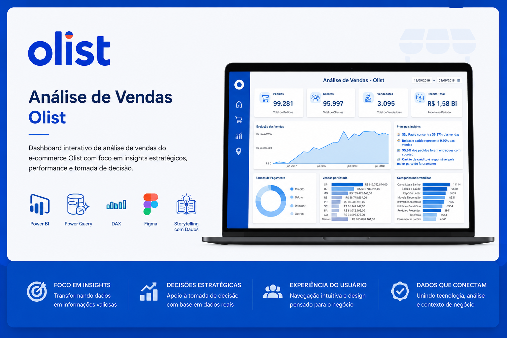
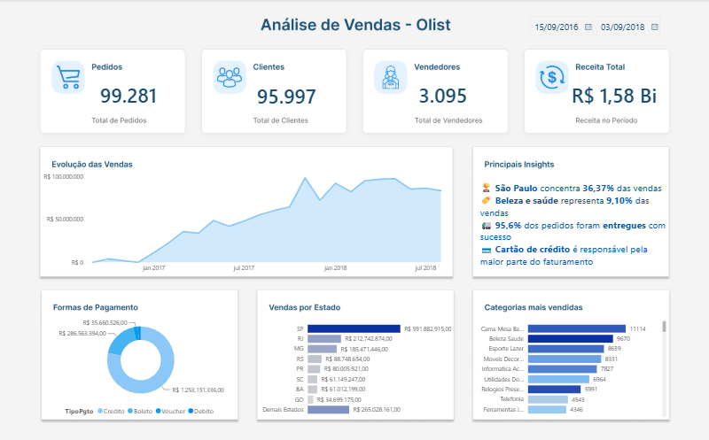

# 🛒 Dashboard de Análise de Vendas — Power BI
_Power BI • DAX • Power Query • Figma_

Dashboard interativo de análise de vendas do e-commerce Olist com foco em insights estratéticos, perfomance e tomada de decisão.

Todos os dados utilizados são públicos e destinados exclusivamente para fins de estudo e composição de portfólio.

---

## 🧠 Principais Habilidades

* Power Query para processos de ETL
* Linguagem DAX para desenvolvimento de métricas e indicadores
* Design UX/UI focado na experiência do usuário
* Storytelling com dados
* Pensamento analítico aplicado ao negócio

---

## 📊 Estrutura do Projeto

Visão geral dos principais indicadores com evolução temporal e descrição do perfil do consumidor e características das principais vendas realizadas.

---

## 💡 Principais Insights

* 🏆 São Paulo concentra 36,37% das vendas
* 🏷️ A categoria Beleza e Saúde representa 9,10% do faturamento
* 🚛 95,6% dos pedidos foram entregues com sucesso 
* 💳 Cartão de crédito é responsável pela maior parte do faturamento 

---

## 🛠️ Ferramentas Utilizadas

* Microsoft Power BI
* Power Query
* Linguagem DAX
* Microsoft Excel
* Figma (UX/UI e apresentação do case)

---

## 🗃️ Arquivos

* README.md
* Apresentação do projeto
* Imagens do dashboard

## 🗄️ Download do Database

Base de dados disponibilizada [aqui](https://www.kaggle.com/datasets/olistbr/brazilian-ecommerce).

## 📥 Download do Dashboard

Devido ao tamanho do arquivo, o `.pbix` está disponível para download através do link abaixo:

🔗 [Download do Dashboard (.pbix)](https://drive.google.com/drive/folders/1cg9jaJwwHmtxjSA2PJooSbPe-vjl5Roe?usp=sharing)

---

## 🚀 Como Utilizar

1. Clone este repositório e baixe os arquivos nos links externos;
2. Abra o arquivo `.pbix` utilizando o Power BI Desktop;
3. Importe a base de dados disponibilizada;
4. Atualize as consultas e explore o dashboard.

---

## 📬 Contato

* E-mail: [gioferracini97@gmail.com](mailto:gioferracini97@gmail.com)
* LinkedIn: [linkedin.com/in/giovanniferracinidata/](https://www.linkedin.com/in/giovanniferracinidata/)

---

⭐ Este projeto representa não apenas uma solução em Power BI, mas também a evolução da forma como enxergo a construção de dashboards: menos foco em gráficos e mais foco em comunicação, contexto e tomada de decisão.
